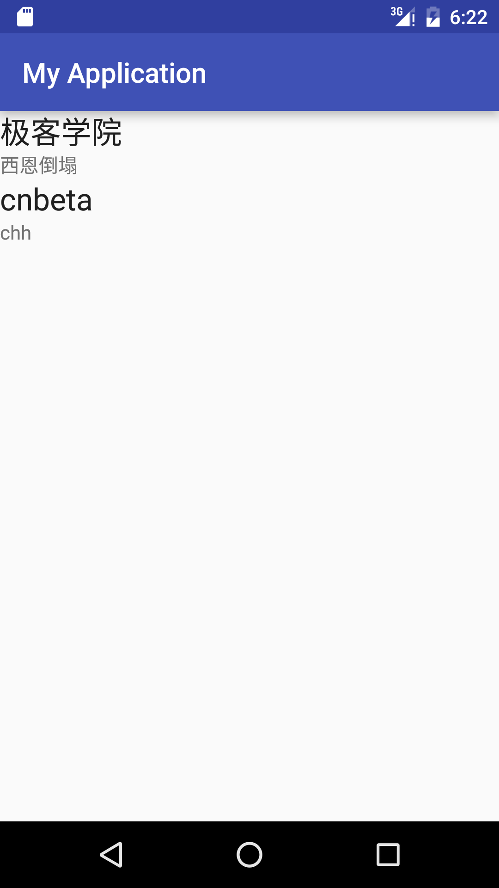

**MainActivity.java**

```java
package com.example.mystady.myapplication;

import android.support.v7.app.AppCompatActivity;
import android.os.Bundle;
import android.support.v7.widget.LinearLayoutManager;
import android.support.v7.widget.RecyclerView;

public class MainActivity extends AppCompatActivity {

    private RecyclerView rv;


    @Override
    protected void onCreate(Bundle savedInstanceState) {
        super.onCreate(savedInstanceState);

        rv= new RecyclerView(this);
        //初始化RecyclerView
        setContentView(rv);
        //设置contentView

        rv.setLayoutManager(new LinearLayoutManager(this));

        rv.setAdapter(new MyAdapter());
    }

}
```

**MyAdapter.java**

```java
package com.example.mystady.myapplication;

import android.support.v7.widget.RecyclerView;
import android.view.LayoutInflater;
import android.view.View;
import android.view.ViewGroup;
import android.widget.TextView;

/**
 * Created by wang on 2016/5/14.
 */
class MyAdapter extends RecyclerView.Adapter {
    //Adapter是连接后端数据和前端显示的适配器接口

    class vh extends RecyclerView.ViewHolder {

        private View root;
        private TextView tvTitle,tvContent;

        public vh(View root) {
            super(root);

            tvTitle= (TextView) root.findViewById(R.id.tvTitle);
            tvContent= (TextView) root.findViewById(R.id.tvContent);
        }

        public TextView getTvContent() {
            return tvContent;
        }

        public TextView getTvTitle() {
            return tvTitle;
        }
    }

    @Override
    public RecyclerView.ViewHolder onCreateViewHolder(ViewGroup parent, int viewType) {
        return new vh(LayoutInflater.from(parent.getContext()).inflate(R.layout.liset_cell,null));
        //创建一个布局解释器
    }

    @Override
    public void onBindViewHolder(RecyclerView.ViewHolder holder, int position) {
        vh vssh = (vh) holder;

        CellData cd =data[position];

        vssh.getTvTitle().setText(cd.title);
        vssh.getTvContent().setText(cd.content);

    }

    @Override
    //设置数量
    public int getItemCount() {

        return data.length;
    }

    private CellData[] data=new CellData[]{new CellData("极客学院","西恩倒塌"),new CellData("cnbeta","chh")};
}
```

CellData.java

```java
package com.example.mystady.myapplication;

/**
 * Created by wang on 2016/5/14.
 */
public class CellData {

    public CellData(String title,String content){

        this.content=content;
        this.title=title;
    }

    public String title="title";
    public String content="content";

}
```

**liset_cell.xml**

```xml
<?xml version="1.0" encoding="utf-8"?>
<LinearLayout xmlns:android="http://schemas.android.com/apk/res/android"
    android:orientation="vertical"
    android:layout_width="match_parent"
    android:layout_height="match_parent">

    <TextView
        android:layout_width="fill_parent"
        android:layout_height="wrap_content"
        android:textAppearance="?android:attr/textAppearanceLarge"
        android:text="Title"
        android:id="@+id/tvTitle"
        android:layout_gravity="center_horizontal" />

    <TextView
        android:layout_width="fill_parent"
        android:layout_height="wrap_content"
        android:text="Content"
        android:id="@+id/tvContent"
        android:layout_gravity="center_horizontal" />
</LinearLayout>
```